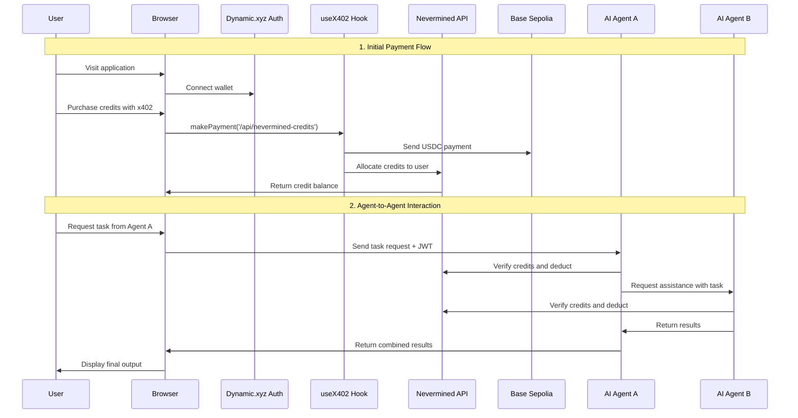

This is a [Next.js](https://nextjs.org) project bootstrapped with [`create-next-app`](https://nextjs.org/docs/app/api-reference/cli/create-next-app).

# X402 + Nevermined: AI Agent Economy Integration


This project demonstrates a complete integration of the [x402 Payment Protocol](https://docs.x402.org/) with [Nevermined](https://nevermined.io/) to create a powerful system for AI agent monetization and agent-to-agent interactions.

## The Problem We're Solving

Traditional Web3 applications require users to sign blockchain transactions for every interaction, creating a poor user experience and limiting automated agent interactions. Our solution combines:

1. **x402 for one-time payments** - Make a single cryptocurrency payment to purchase credits
2. **Nevermined for credit management** - Use purchased credits to access multiple AI agents
3. **Agent-to-agent interactions** - Let your AI agents pay other agents without additional signatures

This eliminates the need for constant transaction signing or using vulnerable session keys, creating a seamless experience for both end-users and AI agents.

## How It Works



## Features

- **Unified Authentication** - Secure wallet authentication via [Dynamic.xyz](https://dynamic.xyz)
- **One-time Payments** - Purchase credits via [x402 protocol](https://x402.org) with a single transaction
- **Credit System** - Manage AI agent access with [Nevermined](https://nevermined.io) credits
- **Agent Economy** - Enable agent-to-agent transactions without user intervention
- **Testnet Integration** - Built on Base Sepolia for easy testing without real funds

## Tech Stack

- [Next.js](https://nextjs.org/) - React framework for the frontend
- [Dynamic.xyz](https://dynamic.xyz) - Web3 wallet authentication
- [x402](https://x402.org) - Payment protocol using HTTP 402 status code
- [Nevermined](https://nevermined.io) - Credit-based system for AI agent economy
- [Viem](https://viem.sh) - Ethereum interaction library
- [Base Sepolia](https://docs.base.org/network-information) - Testnet for transactions

## Setup & Configuration

### Prerequisites

- Node.js (v16+)
- pnpm
- MetaMask or other Web3 wallet
- Testnet USDC on Base Sepolia (available from [Circle Faucet](https://faucet.circle.com/))

### Installation

1. Clone the repository:
   ```bash
   git clone https://github.com/yourusername/x402-nevermined.git
   cd x402-nevermined
   ```

2. Install dependencies:
   ```bash
   pnpm install
   ```

3. Create a `.env.local` file:
   ```
   # x402 Configuration
   NEXT_PUBLIC_PAYMENT_RECIPIENT_ADDRESS="your-address"
   NEXT_PUBLIC_USDC_CONTRACT_ADDRESS="0x036CbD53842c5426634e7929541eC2318f3dCF7e"
   NEXT_PUBLIC_DYNAMIC_ENVIRONMENT_ID="your-dynamic-id"

   # Nevermined Configuration
   NEXT_PUBLIC_NEVERMINED_ENVIRONMENT=appBase
   NEXT_PUBLIC_NEVERMINED_RETURN_URL=http://localhost:3000/callback
   NEXT_PUBLIC_NEVERMINED_APP_ID=your-app-id
   NEXT_PUBLIC_NVM_AGENT_DID=did:nv:your-agent-id
   ```

4. Start the development server:
   ```bash
   pnpm dev
   ```

5. Open [http://localhost:3000](http://localhost:3000) with your browser.

### Important Setup Note

Before using the demo, you need to:
1. Create your own Nevermined Payment Plan and AI agent at [https://base.nevermined.app](https://base.nevermined.app)
2. Add your Nevermined API keys and agent DIDs to the `.env.local` file

## Benefits of This Integration

1. **Better User Experience**: Users make just one payment for multiple AI interactions
2. **Enhanced Security**: No need for session keys or constant signatures
3. **Agent Autonomy**: AI agents can operate and pay other agents without user intervention
4. **Scalability**: Perfect for complex AI workflows involving multiple specialized agents
5. **Economy of Scale**: Acquire credits in bulk, then use them across multiple services

## Learn More

- [X402 Protocol Documentation](https://x402.gitbook.io/x402/)
- [Nevermined Documentation](https://docs.nevermined.app)
- [Dynamic.xyz Documentation](https://docs.dynamic.xyz/introduction/welcome)
- [Base Sepolia Testnet](https://docs.base.org/network-information)

## License

MIT

## Implementation Architecture

### Core Components

- **`hooks/useX402.ts`**: Primary hook for handling x402 payments
  - Connects to user's wallet via Dynamic Auth
  - Manages payment flow including blockchain transactions

- **`components/NeverminedProvider.tsx`**: Context provider for Nevermined SDK
  - Manages credit allocation and verification
  - Handles agent authentication and authorization

- **`app/api/nevermined-credits/route.ts`**: Credits purchase endpoint
  - Implements the 402 Payment Required response
  - Converts x402 payments to Nevermined credits

- **`app/api/premium-content/route.ts`**: Example protected content endpoint
  - Verifies Nevermined credits
  - Serves premium content based on credit verification

### AI Agent Integration

- **Agent Registration**: Register AI agents with Nevermined
- **Credit-Based Access**: Set credit costs for agent usage
- **JWT Authentication**: Access agents using JWT tokens
- **Agent-to-Agent Communication**: Enable agents to pay other agents with credits

## Configuration

Set up the following environment variables in `.env.local`:

```
# x402 Configuration
NEXT_PUBLIC_PAYMENT_RECIPIENT_ADDRESS="0x..."
NEXT_PUBLIC_USDC_CONTRACT_ADDRESS="0x036CbD53842c5426634e7929541eC2318f3dCF7e"
NEXT_PUBLIC_DYNAMIC_ENVIRONMENT_ID="your-dynamic-id"

# Nevermined Configuration
NEXT_PUBLIC_NEVERMINED_ENVIRONMENT=appArbitrum
NEXT_PUBLIC_NEVERMINED_RETURN_URL=http://localhost:3000/callback
NEXT_PUBLIC_NEVERMINED_APP_ID=your-app-id
```

## Testing the Integration

1. Connect your wallet using Dynamic Auth
2. Ensure you have USDC on Base Sepolia testnet
   - Get testnet USDC from the [Base Sepolia Faucet](https://www.coinbase.com/faucets/base-sepolia-faucet)
3. Purchase Nevermined credits using x402 payment
4. Access AI agents using your purchased credits
5. Test agent-to-agent interactions without additional signatures

## Implementation Notes

- Uses [viem](https://viem.sh) for blockchain interactions
- Implements the [ERC-20](https://eips.ethereum.org/EIPS/eip-20) token standard for USDC payments
- Built on [Base Sepolia](https://docs.base.org/network-information) testnet
- Authentication via [Dynamic](https://dynamic.xyz) wallet authentication
- Credit management via [Nevermined](https://nevermined.io/) SDK

## Deployment

The easiest way to deploy your Next.js app is to use the [Vercel Platform](https://vercel.com/new?utm_medium=default-template&filter=next.js&utm_source=create-next-app&utm_campaign=create-next-app-readme) from the creators of Next.js.

Check out our [Next.js deployment documentation](https://nextjs.org/docs/app/building-your-application/deploying) for more details.
